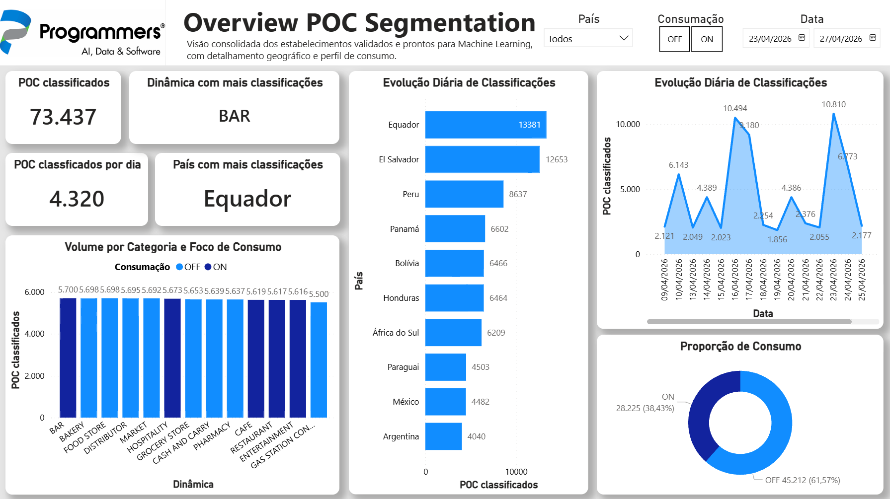
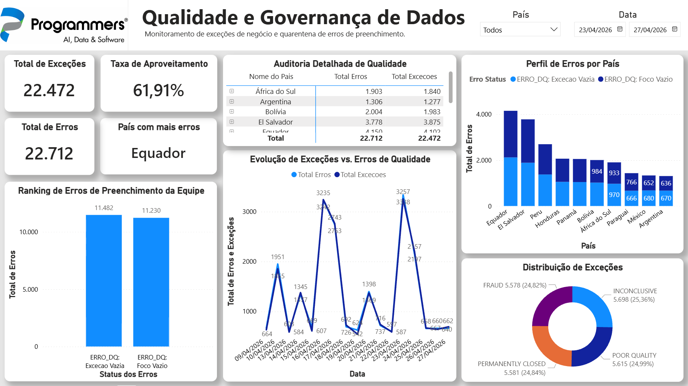
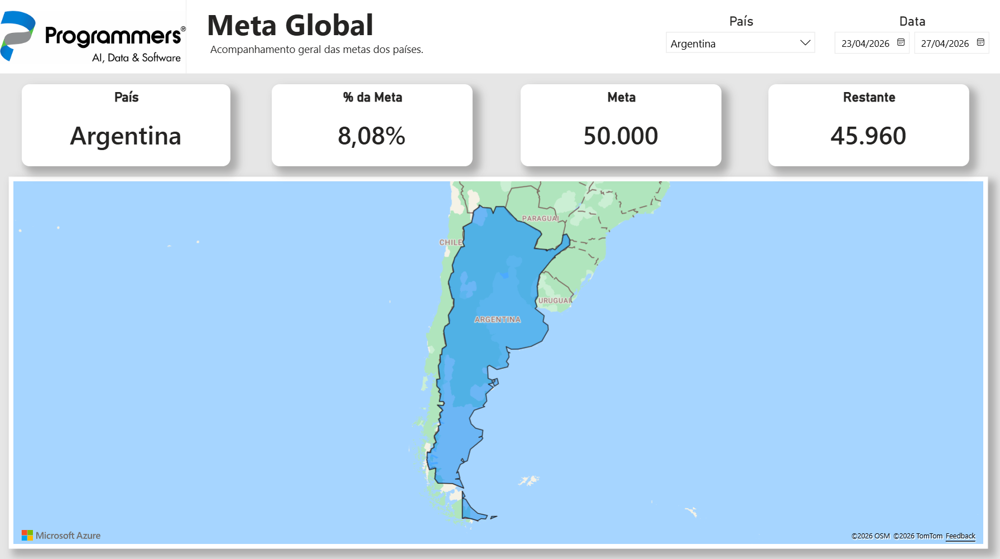
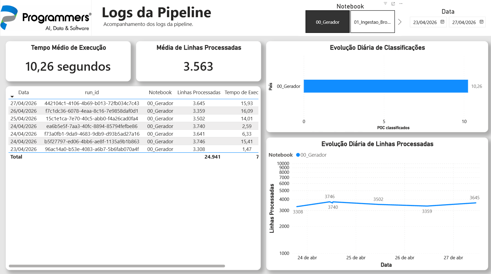

# 🚀 End-to-End Data Engineering Pipeline: Azure & Databricks

## 📌 Visão Geral do Projeto
Este projeto é uma simulação da arquitetura ponta a ponta desenvolvida para o processamento e segmentação de dados de **Point of Consumption (POC)** — estabelecimentos comerciais distribuídos pela América Latina e África do Sul. 

O objetivo da pipeline é processar metadados derivados de análises de imagens de PDVs, classificando o perfil desses estabelecimentos. A classificação se refere ao tipo de estabelecimento (ex: Restaurant, Padaria, Bar e etc), se a consumação no local e identificar quando a excessões quando foge a regra. A esteira realiza a ingestão, limpeza, classificação e agregação em escala utilizando a **Arquitetura Medalhão** (Bronze, Silver e Gold).

O grande diferencial desta arquitetura é a implementação de **Carga Incremental (Watermark)** para lidar com o fluxo contínuo de dados do continente, além de um sistema robusto de **Observabilidade e Logs de Performance**.

## 🛠️ Tech Stack e Ferramentas
* **Orquestração:** Azure Data Factory (ADF)
* **Processamento & Analytics:** Azure Databricks (PySpark, Spark SQL)
* **Armazenamento de Dados:** Azure Data Lake Storage Gen2 (ADLS)
* **Formato de Dados:** Delta Lake
* **Governança:** Unity Catalog
* **Visualização:** Power BI (Direct Query via Databricks Connector)

## 🏗️ Arquitetura e Fluxo de Dados
A esteira de dados foi desenhada para processar arquivos diários com alta eficiência:

1.  **Landing Zone (Gerador):** Script em PySpark que simula a chegada diária de arquivos CSV contendo transações e classificações de estabelecimentos internacionais.
2.  **Camada Bronze (Ingestão):** * Leitura raw dos arquivos CSV.
    * Adição de metadados cruciais (`ingestion_date`) para controle temporal.
    * Proteção contra quebra de schema (`Schema Evolution`).
3.  **Camada Silver (Limpeza e Regras de Negócio):** * Implementação de **Carga Incremental**. O processamento lê apenas os dados novos que chegaram desde a última execução, reduzindo drasticamente custos de computação.
    * Aplicação de regras de Data Quality (DQ), separando dados válidos para Machine Learning, exceções de negócio e registros com erro.
    * Particionamento físico por data para otimizar futuras leituras.
4.  **Camada Gold (Agregação):**
    * Modelagem dos dados para nível diário (Agregações matemáticas).
    * Execução do comando `OPTIMIZE` com `ZORDER BY` para indexação avançada, permitindo que o Power BI consuma a tabela de milhões de linhas instantaneamente.

## 📈 Dashboards do PBI
Aqui esta algumas imagens dos dashboards do projeto afim de facilitar a visualização dos dados gerados e processados.

  
<strong>📊 Clique aqui para expandir e ver as 4 páginas do Dashboard</strong>

   

  ### 1. Visão Executiva e Tempos de Execução
  *(Breve descrição do que essa página mostra, ex: Acompanhamento de SLAs e gargalos)*
  

  ### 2. Volumetria e Carga Incremental
  *(Ex: Crescimento diário da camada Gold vs deltas da Silver)*
  

  ### 3. Análise de Exceções de Negócio
  *(Ex: Monitoramento de PDVs fechados ou com fraude visual)*
  

  ### 4. Qualidade de Dados (Data Quality)
  *(Ex: Quarentena de registros com erros de preenchimento)*
  

## 📊 Observabilidade
Para garantir a saúde da pipeline em produção, foi desenvolvida uma tabela de log (`log_execucao_pipeline`) que registra:
* Tempo exato de execução de cada notebook.
* Volumetria de dados processada por etapa.
* Rastreabilidade via `RunID` dinâmico injetado diretamente pelo Azure Data Factory.

Estes logs alimentam um Dashboard de Observabilidade no Power BI, permitindo a detecção imediata de gargalos ou quedas de performance ao longo do tempo.

## 💡 Principais Desafios Resolvidos
* **Lazy Evaluation no Spark:** Uso estratégico dos comandos `.cache()` e `.unpersist()` na camada Silver para evitar reprocessamento desnecessário do DataFrame ao bifurcar os dados em 3 tabelas diferentes.
* **Otimização de Clusters:** Conversão de lógicas complexas para funções nativas do PySpark, evitando UDFs em Python puro.
* **Small Files Problem:** Uso de `.coalesce(1)` na geração e controle de particionamento na escrita Delta.

---
*Projeto desenvolvido como demonstração prática de habilidades avançadas em Arquitetura de Dados em Nuvem.*